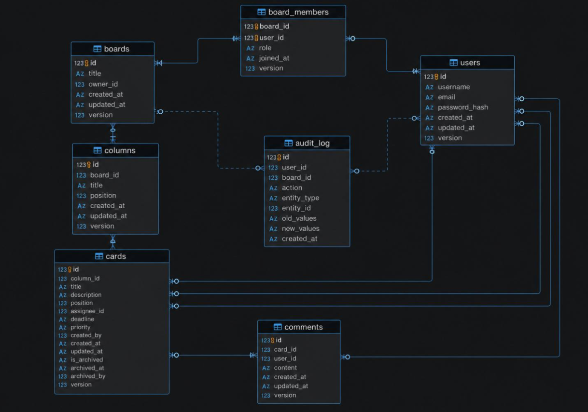

# KJU Kanban
Проект "Канбан-доска" - веб-приложение для управления задачами с поддержкой
досок, колонок, карточек, комментариев и системы аудита.
## Проект Kanban доска

### как запустить через Docker

1) клонировать репозиторий
```commandline
git clone ссылка на репозиторий
```
2) перейти в нужную папку
```commandline
cd kju
```
3) установить зависимости
```commandline
pip install -r requirements.txt
```
4) перейти в терминал докера и собрать контейнер
```commandline
docker-compose build
```
5) запустить контейнер
```commandline
docker-compose up -d
```
6) перейти на http://localhost

### Технологии

- Бэкенд: FastAPI, SQLAlchemy, Alembic, Uvicorn
- База данных: SQLite
- Фронтенд: HTML, CSS, Vanilla JS
- Контейнеризация: Docker, Docker Compose
- Веб-сервер: Nginx

### ER-схема базы данных и механизм защиты


### Механизм зашиты от коллизий
Для предотвращения конфликтов при одновременном редактировании используется оптимистичная блокировка (версионирование).\
Во все изменяемые таблицы добавлено поле version. При каждом обновлении проверяется совпадение версий.\
Если версия изменилась (другой пользователь уже обновил запись), возвращается ошибка 409 Conflict.\
Клиент получает уведомление и должен обновить данные перед повторной попыткой сохранения.

### Основные возможности
- Регистрация и авторизация пользователей
- Роли: владелец, участник, читатель
- Создание, редактирование и удаление досок
- Создание колонок и карточек
- Drag & Drop перемещение карточек
- Комментарии к карточкам
- Приоритеты задач (низкий, средний, высокий)
- История изменений (для владельца доски)

